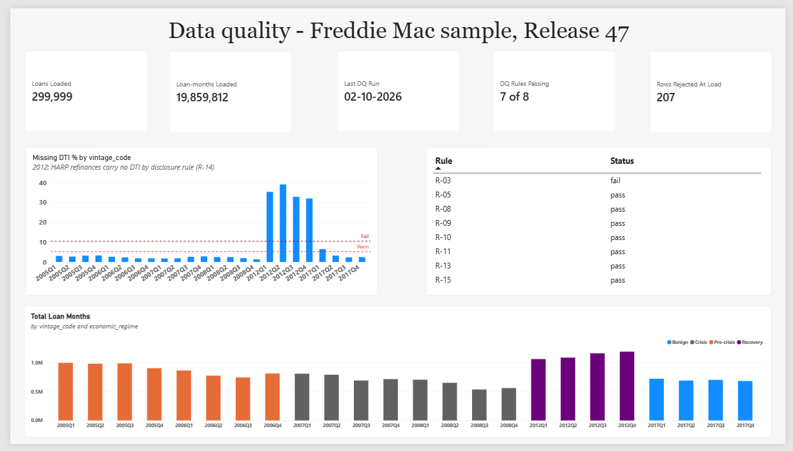
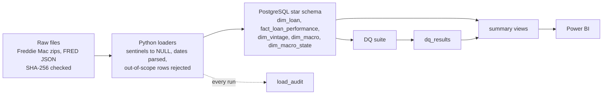

# Credit Risk Projects

[](https://github.com/kunaly0/Credit_Risk_Projects/actions/workflows/ci.yml)

Before a bank can build a credit risk model, it needs loan data it can trust
and trace back to the source. This project builds that foundation for a
probability of default model: about 300,000 Freddie Mac mortgages and their 19.9 million monthly records, from six vintages covering pre-crisis, crisis, recovery and benign years, loaded into
PostgreSQL alongside FRED macroeconomic data, with data quality rules, an
audit trail and a log of every decision. One early lesson: Freddie Mac's own
user guide did not match the files I downloaded, which had three more fields
and loss and recovery amounts with their signs reversed, so every field was
checked against the data rather than the document.

| Project | Status |
|---|---|
| 0 - Data foundation: Freddie Mac loans and FRED macro data in PostgreSQL, with data quality rules and an audit trail | Complete, October 2026 |
| 1 - Probability of default scorecard | Next |

## Project 0 at a glance



- **299,999 loans and 19,859,812 loan-months** from six Freddie Mac vintages
  (2005-2008, 2012, 2017), in a partitioned star schema and reconciled to the
  source files. The one missing loan is a 2009 loan found in the 2008 file and
  rejected on purpose.
- **20 data quality rules**, 8 of them run automatically with results stored
  in the database. Missing DTI jumps to 32-39% for 2012 loans; the cause is
  HARP refinances, which Freddie Mac publishes without a DTI.
- **FRED macro data** (unemployment, house prices, mortgage rates, GDP) at
  national and state level, with every loan month matched nationally.
- **An audit trail that can be checked**: every raw file has a SHA-256
  checksum, verified on two disks; every load writes an audit row, failed
  ones included; the database backup is tested by restoring it.
- **The full dataset (8.7 million loans) is downloaded and checksummed** but
  not loaded. Development uses Freddie Mac's sample; the full files are kept
  for out-of-sample validation in Project 1.



## How the data is organised

| Table | One row per | Rows |
|---|---|---|
| dim_loan | loan | 299,999 |
| fact_loan_performance | loan per month, in 24 partitions by vintage | 19,859,812 |
| dim_vintage | origination quarter | 24 |
| dim_macro | month, national | 320 |
| dim_macro_state | state per month | 16,638 |
| load_audit, load_audit_field | load run, and field count per run | - |
| dq_results | rule measurement per DQ run | - |

The fact table's primary key includes `vintage_code` because PostgreSQL
requires the partition key in it. That alone would let one loan-month appear
under two vintages, so a DQ rule (R-08) checks it never does.

## Reproduce it

The data is not in this repo. You need the Freddie Mac sample files (free
download after registering with Freddie Mac), a FRED API key, PostgreSQL 15
or later and Python 3.13.

```powershell
python -m venv .venv
.venv\Scripts\activate
pip install -r requirements.txt
copy .env.example .env      # then fill in the database login, DATA_ROOT and FRED_API_KEY

createdb -h localhost -U postgres credit_risk
psql -h localhost -U postgres -d credit_risk -f sql/ops/build_all.sql
python -m scripts.load_sample --root <folder holding sample_2005/ to sample_2017/>
python src/macro/load_fred.py
python src/dq/run_dq_suite.py
```

Then check the result: `sql/ops/table_row_counts.sql` for row counts,
`sql/dq/macro_coverage.sql` for macro coverage, and
`python scripts/verify_raw_checksums.py` for the raw files. A new FRED pull
returns the latest revised figures, so macro values can differ slightly from
mine (D-041).

## How it was built

The work ran in sections, S00 to S07, and commit messages start with the
section they belong to.

| Section | What it covered |
|---|---|
| S00 | Setup: repository, secret scanning, cloud database and deployment test, load speed measurements |
| S01 | Data dictionary for both Freddie Mac files, checked field by field against the data |
| S02 | Schema: star schema, 24 partitions, constraints |
| S03 | Loading: Python loader, sentinel handling, audit tables, reconciliation |
| S04 | Data quality: 18 rules, the automated suite, missing-data methodology |
| S05 | SQL check against the loaded data (joins, window functions, CTEs). No code committed |
| S06 | Macro data: FRED national and state series, coverage check |
| S07 | Governance: lineage, governance report, dashboard, backup, CI, this README |

## Documents

| Document | What it holds |
|---|---|
| [Decision log](docs/DECISIONS.md) | 48 decisions, including incidents and what changed because of them |
| [DQ rules](docs/dq_rules.md) | The 20 rules, their thresholds and results |
| [Lineage](docs/lineage.md) | From raw file to table, and what the lineage cannot show |
| [Governance report](docs/governance_report.md) | Controls tested, findings, open items, limitations |
| [Known defects](docs/known_defects.md) | Defects found, fixed and still open |
| [Data dictionaries](docs/data_dictionary_origination.md) | Every field, for [origination](docs/data_dictionary_origination.md) and [performance](docs/data_dictionary_performance.md) files |
| [Missing data](docs/missing_data_methodology.md) | How each field's gaps will be treated in Project 1 |
| [Backup](docs/postgres_backup.md) | How the database is backed up and the restore test |

## Repository layout

```text
config/       loader and FRED settings
dashboards/   Power BI file
docs/         the documents above, data dictionaries, provenance checksums
scripts/      sample loader, checksum verification
sql/          numbered build files 01-12, plus dq/ (rule queries) and ops/ (build, counts)
src/          etl/ (loader), macro/ (FRED), dq/ (DQ suite)
tests/        unit tests, run on every push
```

Built with PostgreSQL 18, Python 3.13 (psycopg 3, pandas), Power BI Desktop and
GitHub Actions.

Built with AI assistance for code drafting and review. Design decisions, data
checks and findings are my own.

## Licence

MIT
