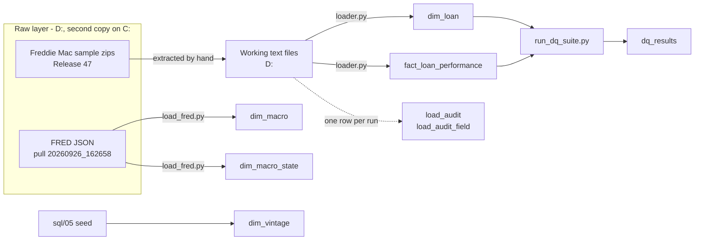

# Data lineage - Project 0

Last verified 2 Oct 2026: raw files against checksums on both disks, row
counts, DQ suite run 13.

The database is local PostgreSQL on C: (D-047). Nothing from Project 0 is
published to Neon yet; it holds only the S00 test table (D-014).

## Sources

| Source | Raw folder | Contents | Integrity record | Check, 2 Oct 2026 |
|---|---|---|---|---|
| Freddie Mac sample, Release 47 | Raw/Freddie_mac/sample | 6 zips, one per vintage year, downloaded Aug 2026 | SHA-256 at download, docs/provenance/checksums_freddie_sample.csv (D-003) | 6 of 6 on both disks |
| Freddie Mac standard | Raw/Freddie_mac/standard | 6 zips. Not loaded (D-035) | checksums_freddie_standard.csv | 6 of 6 |
| LendingClub, Kaggle mirror | Raw/Lending_club | 1 zip. Not loaded; for S19 | checksums_lendingclub.csv | 1 of 1 |
| FRED | Raw/FRED/20260926_162658 | 107 series. 5 requested series do not exist on FRED: GUUR, GUSTHPI, PRSTHPI, VIUR, VISTHPI | manifest.json, SHA-256 per file, written by load_fred.py | 107 of 107 |
| FRED, failed pull | Raw/FRED/20260926_155351 | Same 107 series. The load stopped on the old GDP CHECK and rolled back (D-044). Never loaded | manifest.json | 107 of 107 |

Checked with `scripts/verify_raw_checksums.py`, once against D: and once
with `--root C:\Backup\Datasets`.

## From file to table

| Table | Built from | By | Changed on the way | Rows | Load runs |
|---|---|---|---|---|---|
| dim_vintage | Hand-written seed | sql/05 | - | 24 | - |
| dim_loan | sample_orig_{year}.txt | src/etl/loader.py | Sentinel codes to NULL, counted per field. YYYYMM to date (D-026). Vintage from the loan ID. Loans outside the 24 vintages rejected and counted (D-033) | 299,999 | 1, 5, 6, 8, 9, 10 |
| fact_loan_performance | sample_perf_{year}.txt | src/etl/loader.py | As dim_loan. current_interest_rate above 30 set to NULL and counted (D-032). Negative months_to_maturity counted (D-034) | 19,859,812 | 4, 11, 12, 14, 15, and one of 16-19 |
| dim_macro | FRED national series | src/macro/load_fred.py | Weekly rate averaged per month, quarterly values repeated, GDP growth annualised (D-043). Gaps left NULL (D-045) | 320 | Not recorded |
| dim_macro_state | FRED state series | src/macro/load_fred.py | As dim_macro. Months with no values get no row (D-045) | 16,638 | Not recorded |
| load_audit, load_audit_field | Each loader run | src/etl/loader.py | - | 15, 62 | - |
| dq_results | Each DQ suite run | src/dq/run_dq_suite.py | - | 389 | Runs 1-8 are partial; 9-13 are full runs of 63 rows each |

Joins: fact_loan_performance to dim_loan on loan_sequence_number, and both
to dim_vintage on vintage_code, are foreign keys. Loan month to dim_macro,
and loan state and month to dim_macro_state, have no foreign key; R-20 is
the only proof they match.

## Reconciliation

| Check | Source | Table | Difference |
|---|---|---|---|
| Loans | 300,000 lines in 6 files | 299,999 | Loan F09Q10107924, a 2009Q1 loan in the 2008 file, rejected as out of scope (D-033) |
| Performance rows | 19,860,018 lines in 6 files | 19,859,812 | 206 rows of the same loan. Run 14 read 2,456,504 and loaded 2,456,298 |
| Loan months with a dim_macro row | 255 | 255 | None (R-20) |
| Loan-months with a dim_macro_state row | All but 8,078 | - | GU, VI, and PR in Mar-Apr 2020, about 0.04% (R-20, D-045) |
| Audit total for the fact table | 28,260,469 | 19,859,812 | The 2017 file loaded four times with a TRUNCATE between (R-01 FAIL, defect #12) |

Line counts per file are in docs/row_counts_baseline.csv.

## Missing load runs

load_audit has no runs 2, 3, 7 or 13. A failed load rolled back its own
audit row (defect #1, fixed for later loads on 5 Oct), so each one exists
only as a gap in run_id.

| Run | File | Failed on | Decision |
|---|---|---|---|
| 2 | sample_perf_2005.txt | months_to_maturity below 0, line 568,109 | D-031 |
| 3 | sample_perf_2005.txt | current_interest_rate 48.750, line 3,484,549 | D-032 |
| 7 | sample_orig_2008.txt | vintage 2009Q1 not in dim_vintage | D-033 |
| 13 | sample_perf_2008.txt | months_to_maturity -13 | D-034 |

## What this lineage cannot show

| Gap | Effect | Status |
|---|---|---|
| Raw zips are extracted to Working by hand, with no script and no checksums on the extracted files | Working files are tied to Raw only by line counts, not content | Open |
| Failed loads before 5 Oct left no audit row | Runs 2, 3, 7 and 13 are known only as gaps | Fixed for later loads (#1) |
| TRUNCATE is not logged | The audit cannot say which of runs 16-19 is in the table | Defect #12 |
| load_audit times before 5 Oct came from one transaction | Past durations read 00:00:00 | Fixed for later loads (#2) |
| Field counts in runs 8 and 14 include rows later rejected as out of scope | Run 8 shows 50,000 vantagescore sentinels for 49,999 loans | Fixed for later loads (#14) |
| rows_loaded is counted in Python, not read back from COPY | The count is the loader's own claim | Defect #4 |
| FRED loads write nothing to load_audit, and the macro tables have no pull date | Which pull is loaded is known only from manifest.json and this document | Open. D-041 corrected |
| The loader opens files as UTF-8; config/load_config.yaml says cp1252 and is not read for this | Works for every file so far; a non-ASCII byte would fail the load | S07 step 7 |
| FRED values are the latest revision, not as first published | Backtests use figures nobody had at the time | D-041 |
| Raw PDFs and the provenance CSVs inside Raw have no checksums | Their integrity is not checked | Minor |

## Checking it again

| What | How |
|---|---|
| Raw files unchanged | `python scripts/verify_raw_checksums.py`, then again with `--root C:\Backup\Datasets` |
| Row counts | `sql/ops/table_row_counts.sql`, compared with this document |
| Macro coverage | `sql/dq/macro_coverage.sql` (R-20) |
| Schema builds from nothing | `psql -d <new database> -f sql/ops/build_all.sql` |
| DQ rules | `python src/dq/run_dq_suite.py` |
